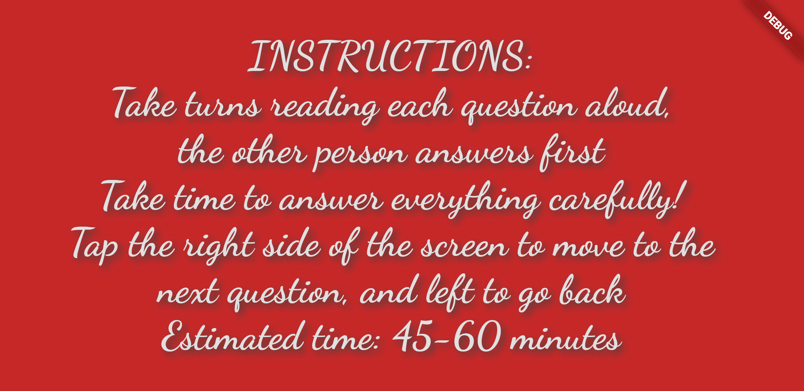
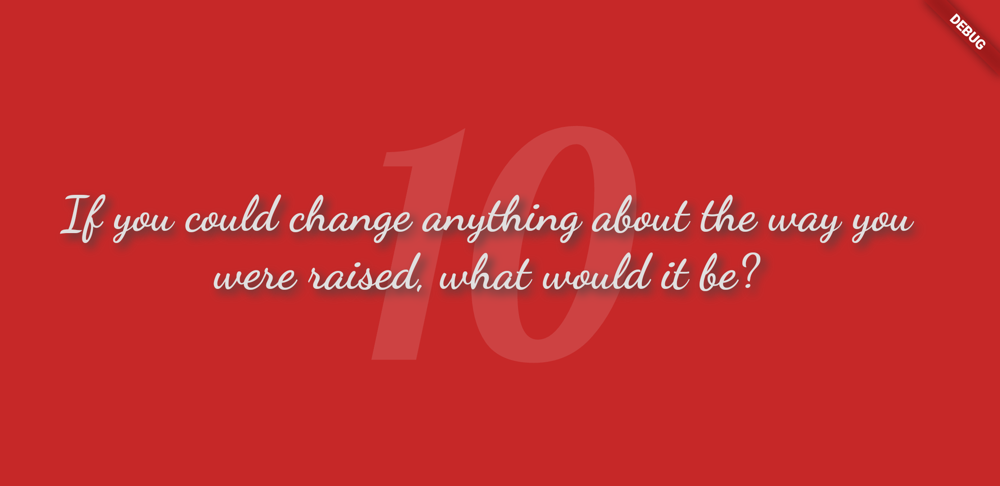

# 36 Questions Plus

A small project to get used to the Flutter framework. Based off the 36 questions from the research paper by A. Aron et Al. (Hit the right side to go to the next question, and the left side to go back)

## Screenshots

* note colours appear slightly off in these screenshots

